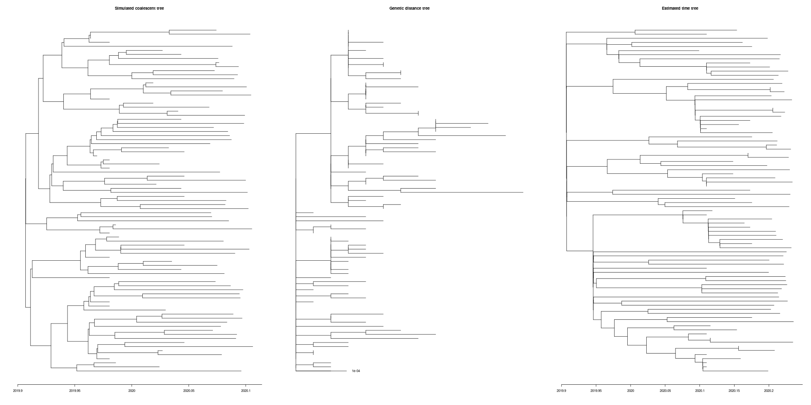
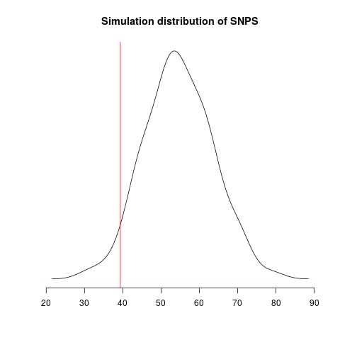
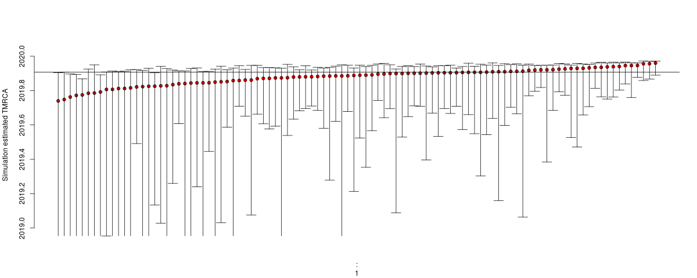
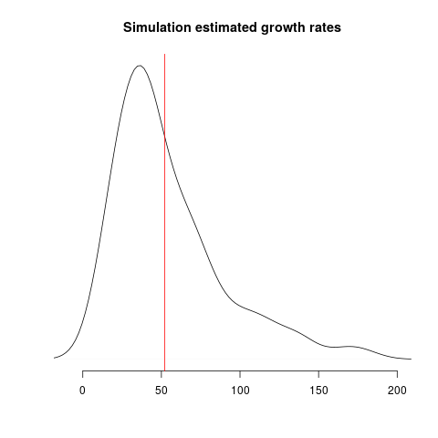
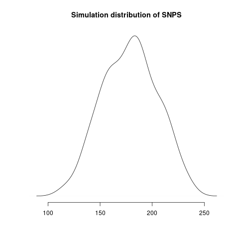
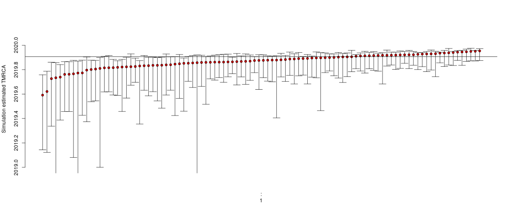
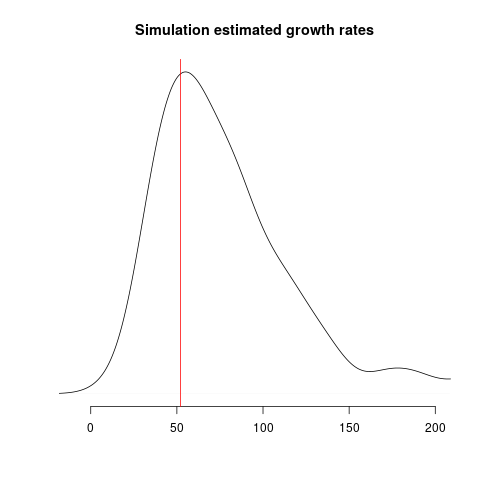

---
author: Erik Volz
date: January 31, 2020
title: How close are we to the 'phylodynamic threshold'? A simulation study.
...

tl;dr: Almost there. Brush off your phylodynamic models. 

Previous reports 
[here](http://virological.org/t/phylodynamic-analysis-46-genomes-31-jan-2020/356?u=erik.volz)
and 
[here](http://virological.org/t/phylodynamic-analysis-of-ncov-2019-genomes-29-jan-2020/353/7?u=erik.volz)
and 
[here](http://virological.org/t/clock-and-tmrca-based-on-27-genomes/347?u=erik.volz)
and
[here](http://virological.org/t/further-musings-on-the-tmrca/340?u=erik.volz)
have shown that current sequences on GISAID and Genbank allow preliminary conclusions to be drawn about TMRCA and substitution rates.
These studies have also found that it is more difficult to compute robust estimates of epidemic growth rates. 
This motivates the question: How much additional sequence data do we require and over what timeframe in order to get precise estimates of growth rates and by extension R0? 
We can investigate that question using simulations, which I report here. 

__Key finding:__

If 50 additional sequences are provided over the first half of February, unbiased estimation of epidemic growth rates should be possible. 
Uncertainty in estimated substitution rates and TMRCA should also be drastically reduced. 

# Methods 

To facilitate computation over many simulations, I use maximum likelihood methods.
All analyses are based on the [Nextstrain](https://nextstrain.org/ncov) build from 30 January 2020 which includes a maximum likelihood tree of 42 sequences (cf acknowledgements). 
Estimates of TMRCA obtained from maximum likelihood methods appear consistent with recent reports using BEAST, but there is considerably more uncertainty in these estimates reflecting the importance of well-chosen & informative priors. 

I simulate coalescent trees conditioning on dates of sampling in the Nextstrain metadata and based on a SIR model calibrated to current epidemic conditions. 
Coalescent simulations are implemented in the [phydynR](https://github.com/emvolz-phylodynamics/phydynR) package.
Genealogical trees are generated under an infinite sites model using a substitution rate and TMRCA estimated using _treedater_ and using the ML tree generated by Nextstrain.
Time trees are then estimated from simulation outputs using _treedater_. 
The [skygrowth](https://github.com/mrc-ide/skygrowth) package is then used to estimate a growth rate from estimated time trees. 

Coalescent trees are based on a simple stochastic frequency-dependent SIR model where the rate of new infections is
$$
\beta S I / (S + I + R)
$$
and infections are removed at rate $ \gamma I $. 
The removal rate $ \gamma = 1/8.4 $ is chosen so that the generation interval matches previous estimates and does not reflect incubation or infectious period: 
[https://www.imperial.ac.uk/media/imperial-college/medicine/sph/ide/gida-fellowships/Imperial-2019-nCoV-transmissibility.pdf](https://www.imperial.ac.uk/media/imperial-college/medicine/sph/ide/gida-fellowships/Imperial-2019-nCoV-transmissibility.pdf)
The transmission rate $$ \beta $$ is chosen to yeild an R0 value of 2.2. 

Secondly, I consider the effect of adding 50 samples stratified over the first two weeks of February. 

The steps involved in the simulation experiment are

1. An epidemic trajectory is simulated from the SIR stochastic differential equations
2. A coalescent tree is simulated conditioning on observed sample times and the SIR trajectory
3. A genealogical tree with branches in units of substitutions/site is generated under an infinite sites model. To reflect uncertainty in topology, this is re-estimated using neighbour joining. 
4. A time tree is estimated with _treedater_
5. The growth rate is estimated with _skygrowth_


## Baseline phylogenetic analysis 

_treedater_ is invoked with 
```
td <- dater( 
	tr # ML tree 
	, sts = sts # sample times
	, s = 29e3 # sequence length
	, estimateSampleTimes = est # ranges for tips with missing sample time
	, omega0 = c( 0.0005, 0.00075, .001) # initial guess of clock rate 
)
```
One missing sample time was imputed. This yields the following maximum likelihood and time tree: 


I estimate the TMRCA to be 2019-11-28 (2019-02-15 --  2019-12-11). The confidence interval is based on parametric bootstrap which is illustrated here:


I estimate the clock rate (substitutions/site/ year) to be 4.42e-04(1.31e-04 -- 1.49e-03). 


## Simulation results based on current samples 

Simulated genealogies show a similar level of diversity as the real data and reveal difficulty of estimating time trees under these conditions: 



Left: A simulated coalescent tree, Middle: A genealogical tree (substitutions/site), Right: An estimated time tree


Simulated genealogical trees imply the following distribution of genetic diversity in simulations. These accord with current observations of number SNPs (red line): 



Estimates of TMRCA show a slight tendency to under-estimate and the lower bound can not be robustly estimated with parametric bootstrap:



Estimates of growth rate are highly variable; the distribution of point estimates overlap with the true value (red line) but there is a downwards bias:




## Simulation results with 50 additional samples over next two weeks

Greater genetic diversity should be observed over next two weeks:



Estimates of TMRCA should become much more robust: 



Estimates of growth rate should fall into aligment with the true value, but we should still expect considerable uncertainty:




# Caveates

- Epidemic dynamics are much more complex than portrayed by this SIR model. Notably, this simulation does not include variance in transmission rates, an incubation period, or geographic structure. 
- Infinite sites simulations do not account for rate variation. 
- Sampling is highly non-random. Cases from travellers are over-represented as are household and nosocomial transmissions. A real analysis would have to exclude redundant samples in sampled transmission chains. I have partially accounted for this by randomly downsampling sample dates to retain 30 samples. This is an approximation. 
- A __well-designed__ Bayesian analysis should have superior performance, but this requires expert choice of informative priors.
- Additional caveates mentioned by other posters regarding sequencing error also apply


# Code

All analysis and simulation code can be found at my fork of the nextstrain/ncov repository here:

[https://github.com/emvolz/ncov](https://github.com/emvolz/ncov)


# Acknowledgements 

Developers and maintainers of Nextstrain deserve enormous credit for facilitating many steps of this analysis. 

Data were shared by [GISAID](https://gisaid.org):
```
 * Shanghai Public Health Clinical Center & School of Public Health, Fudan University, Shanghai, China
   - Wuhan-Hu-1/2019
 * National Institute for Viral Disease Control and Prevention, China CDC, Beijing, China
   - Wuhan/IVDC-HB-01/2019
   - Wuhan/IVDC-HB-04/2020
   - Wuhan/IVDC-HB-05/2019)
 * Institute of Pathogen Biology, Chinese Academy of Medical Sciences & Peking Union Medical College, Beijing, China
   - Wuhan/IPBCAMS-WH-01/2019
   - Wuhan/IPBCAMS-WH-02/2019
   - Wuhan/IPBCAMS-WH-03/2019
   - Wuhan/IPBCAMS-WH-04/2019
 * Wuhan Institute of Virology, Chinese Academy of Sciences, Wuhan, China
   - Wuhan/WIV02/2019
   - Wuhan/WIV04/2019
   - Wuhan/WIV05/2019
   - Wuhan/WIV06/2019
   - Wuhan/WIV07/2019
 * Department of Microbiology, Zhejiang Provincial Center for Disease Control and Prevention, Hangzhou, China
   - Zhejiang/WZ-01/2020
   - Zhejiang/WZ-02/2020
 * Guangdong Provincial Center for Diseases Control and Prevention
   - Guangdong/20SF001/2020
   - Guangdong/20SF012/2020
   - Guangdong/20SF013/2020
   - Guangdong/20SF014/2020
   - Guangdong/20SF025/2020
   - Guangdong/20SF028/2020
   - Guangdong/20SF040/2020
   - Guangdong/20SF174/2020
   - Guangdong/20SF206/2020
   - Guangdong/20SF207/2020
   - Foshan/20SF207/2020
   - Foshan/20SF210/2020
   - Foshan/20SF211/2020
 * Department of Medical Sciences, National Institute of Health, Nonthaburi, Thailand
   - Nonthaburi/61/2020
   - Nonthaburi/74/2020
 * Division of Viral Diseases, Centers for Disease Control and Prevention, USA
   - USA-WA1/2020
   - USA/AZ1/2020
   - USA/IL1/2020
   - USA/CA1/2020
   - USA/CA2/2020
 * Centers for Disease Control, R.O.C., Taipei, Taiwan
   - Taiwan/2/2020
 * Institut Pasteur, Paris, France
   - France/IDF0372/2020
   - France/IDF0373/2020
```

